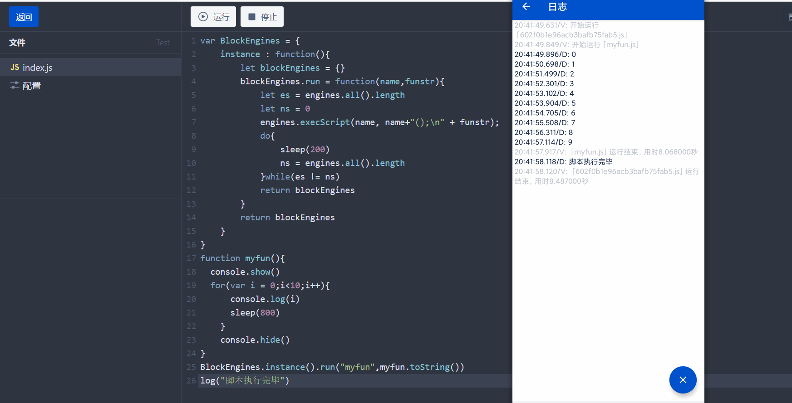

# Hamibot技巧总结
[BlockEngines 阻塞脚本执行工具](#blockengines-工具)<br>
[免费发送Email](#免费发送email)<br>
[AppRunning 软件运行检测](#AppRunning-软件运行检测)
## BlockEngines 工具

>使用场景:

    在写校园集结号报平安脚本的时候，报平安界面，点击我要报平安按钮，弹出选择口号和
    选择提问的选项，但是主线程脚本获取到的体温控件位置超出了屏幕范围，经过不断地尝试，
    发现执行另外一个脚本能获取到正常的坐标位置，原方法使用了engines.exeScript()方法，
    启动另一个脚本，在这里函数可以看作另一个脚本。但是，两个脚本是异步执行，没有说是
    子脚本启动了，主线程脚本就阻塞了，我们有时候是需要阻塞的，那么可以使用BlockEngines
    BlockEngines属于伪阻塞，可以使用BlockEngines同时启动多个子脚本。按顺序执行
    大家可以去写一下校园集结号上报界面自动选择口号和体温的功能。不过脚本要从点击我要上报按钮开始写！

>示例源码

  点击阅读源码： [BlockEngines.js](BlockEngines.js)



>使用步骤：

1. 引入BlockEngines

   ```js
   var BlockEngines = function(){
           let blockEngines = {}
           blockEngines.run = function(name,funstr){
               let es = engines.all().length
               let ns = 0
               console.show()// 如果只是想阻塞主线程脚本，这两句可以删掉
               console.hide()//这两句是解决坐标获取超出屏幕范围的
               engines.execScript(name, name+"();\n" + funstr);
               do{
                   sleep(200)
                   ns = engines.all().length
               }while(es != ns)
               return blockEngines
           }
       return blockEngines
   }
   ```
   
2. 创建子脚本（函数）

   ```js
   function myfun(){
   		console.show()
   		for(var i = 0;i<10;i++){
      		console.log(i)
       	sleep(800)
       }
       console.hide()
   }
   function myfun2(){
   		console.show()
   		for(var i = 0;i<10;i++){
      		console.log(i)
       	sleep(800)
       }
       console.hide()
   }
   ```

3. 运行子脚本
   ```js
   var blockEngines = new BlockEngines()
   blockEngines.run("myfun",myfun.toString())
               .run("myfun2",myfun2.toString())
   ```


## 免费发送Email
   ```js
   function sendEmail(email,etitle,emsg){
          http.get("http://liuxingw.com/api/mail/api.php?address="+email+"&name="+etitle+"&certno="+emsg, {}, function(res, err) {
              if (err) {
                  console.error("邮件发送失败");
                  return;
              }else{
                  log("发送成功")
              }
          });
      }
      sendEmail("12345@gmail.com","邮件标题","邮件内容")
   ```

## AppRunning 软件运行检测

>使用场景:

    一些软件，因为系统的原因启动时存在崩溃（MIUI 12.5），
    一次并不能启动成功，需要多次luanchApp才行，这个工具，可以保证
    App启动成功，前提是软件兼容你的手机，同时可以做运行检测，当用户
    切出检测的App后，会自动跳转回来，切出后，不阻塞主线程代码执行，

>示例源码

点击阅读源码： [AppRunning.js](AppRunning.js)


>使用步骤：

1. 引入AppRunning

   ```js
   var AppRunning = function (){
       this.start = function (appName) {
           let thread = threads.start(function() {
               while(true) {
                   if(currentPackage()!=getPackageName(appName)){
                       launch(getPackageName(appName))
                       sleep(1500)
                   }
                   sleep(500)
               }
           })
           return thread
       },
       this.stop = function (task){
            task.interrupt()
       }
   }
   ```

2. 使用方法
   ```js
   var appRunning = new AppRunning()
   var task = appRunning.start("校园集结号")//启动检测
   
   console.show()
   for(var i = 0;i<15;i++){
       console.log("集结号运行中..."+i)
       sleep(1000)
   }
   
   appRunning.stop(task)//结束检测
   ```